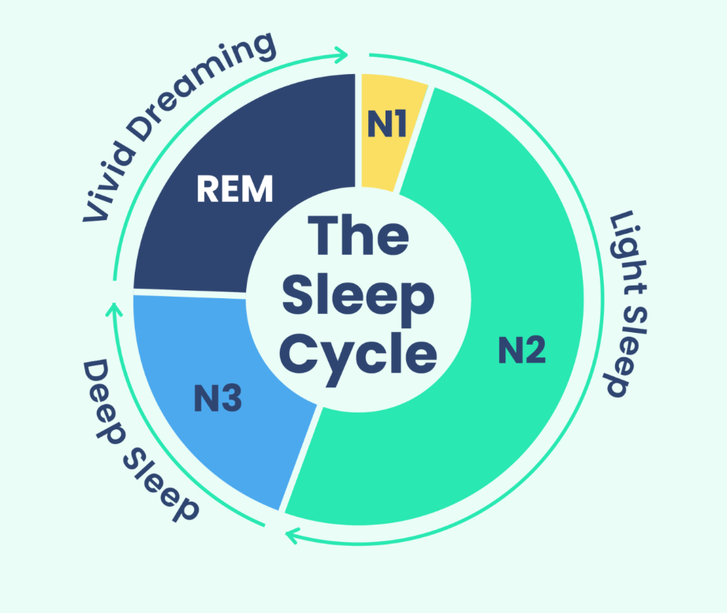

# Research Topic:

## "Exploring Neurological Abnormality Detection in EEG Data with Provided Sleep Stage Annotations"

# Abstract:

This research aims to investigate the detection of neurological abnormalities in EEG data using a dataset containing EEG signals and provided sleep stage annotations. Leveraging comprehensive EEG recordings with accompanying sleep stage annotations, the study seeks to identify abnormal EEG patterns indicative of neurological dysfunction within the context of sleep stages. The primary objective is to develop a method for detecting abnormalities in EEG data that integrates sleep stage information to enhance the accuracy and interpretability of abnormality detection. Through rigorous experimentation and validation using real-world EEG datasets, the proposed approach aims to provide clinicians with a reliable tool for identifying potential neurological abnormalities based on EEG signals and sleep stage annotations. The findings of this research have the potential to contribute to advancements in neurological disorder diagnosis and treatment by providing a comprehensive understanding of abnormal EEG patterns within the context of sleep stages.

# Introduction:

Sleep is a vital physiological function that has a considerable impact on our emotional and physical well-being. A thorough examination of sleep habits can provide information about one's current state of health as well as potential warning signs for the future.
Understanding and treating a wide range of neurological and mental problems that can result from sleep disruptions require an understanding of sleep stages.Traditionally, EEG signals during sleep have been classified using the Rechtschaffen and Kales (R&K) guidelines. Stage 1, Stage 2, Stage 3, Stage 4, REM (Rapid Eye Movement), and movement time are the seven distinct stages that are specified by these principles. These phases, which correlate to various degrees of brain activity, are essential for preserving both physiological and cognitive processes. In order to improve the focus on important stages related to sleep disorders, recent updates to these criteria have reduced classification into three non-rapid eye movement (NREM) stages (N1, N2, N3) and one REM stage.        

These stages of sleep need to be clearly characterised because a variety of health issues are linked to irregular sleep patterns. On the other hand, irregularities in non-REM (rapid eye movement) sleep could indicate problems such as apnoea insensate, limb movement disorder, and even neurological conditions like Alzheimer's and Parkinson's. For example, mood disorders and cognitive decline have been associated with anomalies in rapid eye movement (REM) sleep. The intricacy of deciphering EEG data makes human classification labour-intensive and prone to error.    

# Plotting PSGs and Hypnograms 

