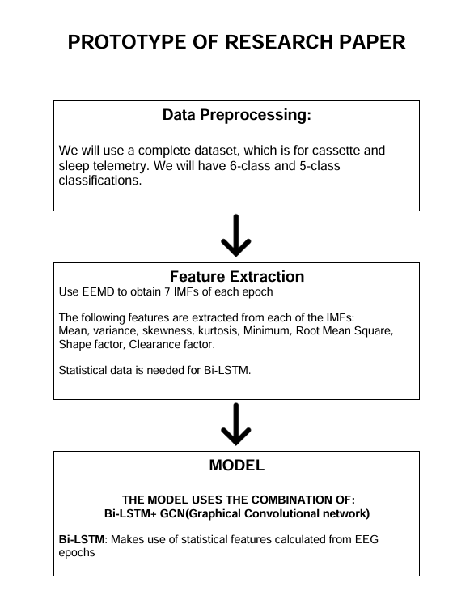
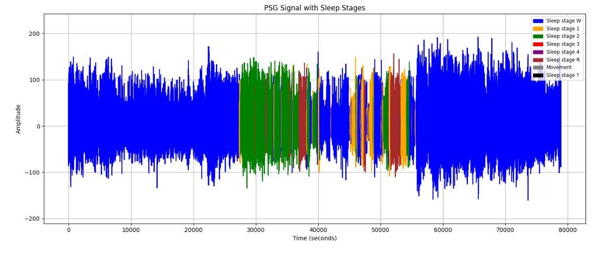
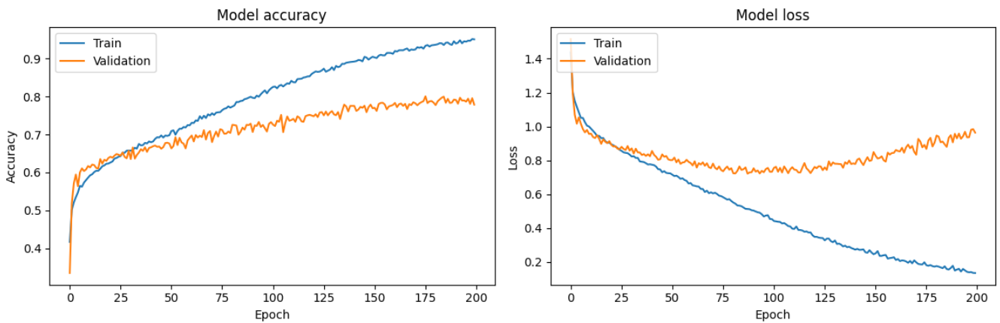
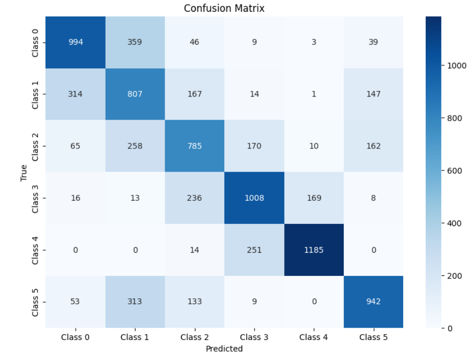
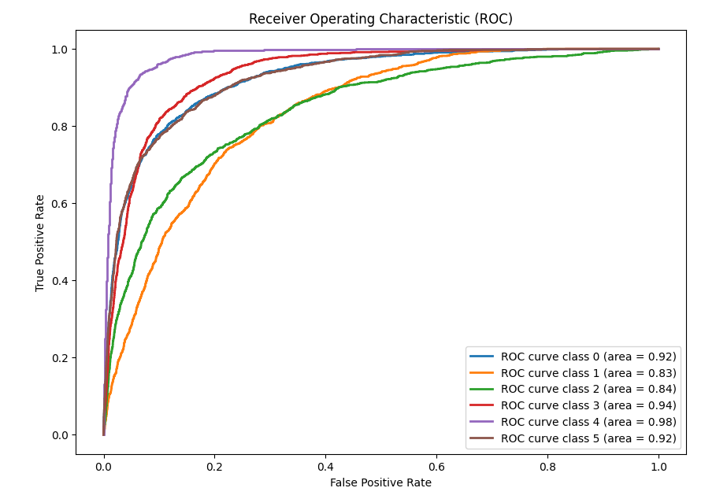
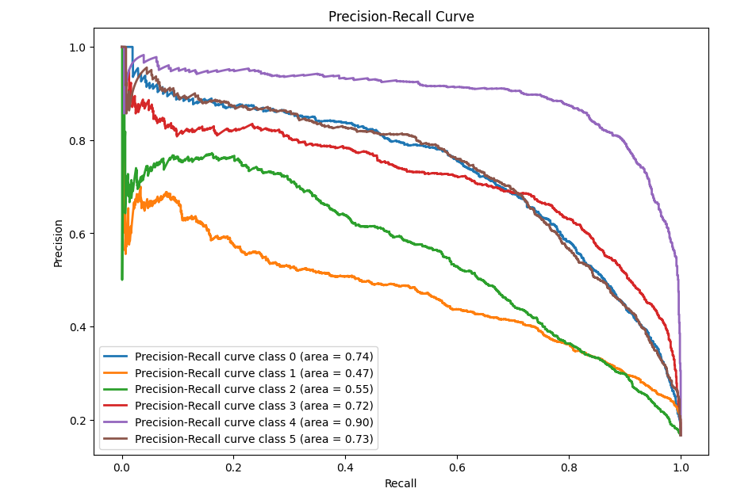

# Research Topic:

## "Exploring Neurological Abnormality Detection in EEG Data with Provided Sleep Stage Annotations"

# Prototype

# Abstract:

This research aims to investigate the detection of neurological abnormalities in EEG data using a dataset containing EEG signals and provided sleep stage annotations. Leveraging comprehensive EEG recordings with accompanying sleep stage annotations, the study seeks to identify abnormal EEG patterns indicative of neurological dysfunction within the context of sleep stages. The primary objective is to develop a method for detecting abnormalities in EEG data that integrates sleep stage information to enhance the accuracy and interpretability of abnormality detection. Through rigorous experimentation and validation using real-world EEG datasets, the proposed approach aims to provide clinicians with a reliable tool for identifying potential neurological abnormalities based on EEG signals and sleep stage annotations. The findings of this research have the potential to contribute to advancements in neurological disorder diagnosis and treatment by providing a comprehensive understanding of abnormal EEG patterns within the context of sleep stages.

# Introduction:

Sleep is a vital physiological function that has a considerable impact on our emotional and physical well-being. A thorough examination of sleep habits can provide information about one's current state of health as well as potential warning signs for the future.
Understanding and treating a wide range of neurological and mental problems that can result from sleep disruptions require an understanding of sleep stages.Traditionally, EEG signals during sleep have been classified using the Rechtschaffen and Kales (R&K) guidelines. Stage 1, Stage 2, Stage 3, Stage 4, REM (Rapid Eye Movement), and movement time are the seven distinct stages that are specified by these principles. These phases, which correlate to various degrees of brain activity, are essential for preserving both physiological and cognitive processes. In order to improve the focus on important stages related to sleep disorders, recent updates to these criteria have reduced classification into three non-rapid eye movement (NREM) stages (N1, N2, N3) and one REM stage.        

These stages of sleep need to be clearly characterised because a variety of health issues are linked to irregular sleep patterns. On the other hand, irregularities in non-REM (rapid eye movement) sleep could indicate problems such as apnoea insensate, limb movement disorder, and even neurological conditions like Alzheimer's and Parkinson's. For example, mood disorders and cognitive decline have been associated with anomalies in rapid eye movement (REM) sleep. The intricacy of deciphering EEG data makes human classification labour-intensive and prone to error.    

# Plotting PSGs and Hypnograms 
.png)

.png)

# PSG Signals with sleep stages

# Dataset Description
We will utilize a comprehensive dataset comprising both cassette and sleep telemetry data. This dataset is specifically designed for the classification of sleep stages and includes recordings segmented into epochs, each representing a distinct sleep stage.

**Classification**
Our study focuses on two classification scenarios:

- **6-Class Classification:** Identifying and classifying each of the six different sleep stages.
- **5-Class Classification:** Aggregating certain sleep stages into a unified class to simplify classification.

# Data Preparation

**Segmentation:**

The sleep signals will be segmented into 30-second epochs. Each epoch will correspond to a single sleep stage, allowing for detailed analysis and classification of sleep stages.

- **Random Sampling:**
To address class imbalance, we will perform random sampling techniques to balance the dataset. This ensures that each sleep stage is represented equally in the training and evaluation phases, enhancing model performance.
Class Merging:

For the 5-class classification, specific sleep stages will be merged into a single class. This simplification aims to provide a more manageable classification problem and improve overall classification accuracy.

**Sleep Dataset:** https://www.physionet.org/content/sleep-edfx/1.0.0/#files-panel

# Feature Extraction Method

For this research paper we have used the EEMD method for extracting different features from the sleep dataset.EEMD, or Ensemble Empirical Mode Decomposition, is a technique used to decompose complex signals into simpler components. It’s an extension of the Empirical Mode Decomposition (EMD) method, which is particularly useful for analyzing non-linear and non-stationary time series data. 

## What is EEMD?
- **Empirical Mode Decomposition (EMD):** EMD decomposes a time series into Intrinsic Mode Functions (IMFs) and a residue. Each IMF represents a simple oscillatory mode of the data, and the residue is the trend component. While EMD is effective for analyzing time series data, it can be sensitive to noise and may result in mode mixing.

- **Ensemble Empirical Mode Decomposition (EEMD):**  EEMD addresses the limitations of EMD by introducing noise into the signal and performing EMD multiple times. The process involves:

- Adding white noise to the original signal.
- Decomposing the noisy signal into IMFs using EMD.
- Averaging the IMFs obtained from multiple realizations to get more stable and reliable results.

# Bi-LSTM + GCN:
  
### Detailed Model Explanation with Layer Contributions and Results Analysis

**1. Data Processing and Feature Scaling**

In the preprocessing step, the features were standardized using StandardScaler. This normalization process helped in stabilizing the training process, as it ensured that the input data, derived from EEG signals, had a mean of zero and a standard deviation of one. 

**2. Adjacency Matrix Threshold Estimation**

The optimal threshold for the adjacency matrix was determined by analyzing the correlation matrix of the feature set. The plot of absolute correlation coefficients and the subsequent elbow point detection helped identify a threshold of *0.96*. This high threshold indicated that only the strongest correlations were considered for creating edges in the graph, resulting in a sparse adjacency matrix. The sparsity was advantageous as it reduced computational load and enhanced the generalization ability of the GCN by focusing on the most significant feature relationships.

**3. Model Architecture: Integration of BiLSTM and GCN**

- **Bidirectional LSTM Layers:**
  - The BiLSTM layers were designed to capture complex temporal dependencies in EEG data, essential for accurately distinguishing between different sleep stages. The architecture included three BiLSTM layers with *64 units each*:
  - The first BiLSTM layer processed the input sequences bidirectionally, allowing the model to consider both past and future information.
  - The subsequent BiLSTM layers, followed by *BatchNormalization*, refined these temporal features further. Batch normalization stabilized and accelerated the training process by normalizing the input to each layer, thus reducing internal covariate shift.
  - **MaxPooling1D** and **UpSampling1D** layers were utilized to manipulate sequence length, enabling the model to focus on different temporal scales and capture both short-term and long-term dependencies in the EEG data.

- **Graph Convolutional Network (GCN) Layer**:
  - The GCN layer, with 64 units, utilized the normalized adjacency matrix to apply graph convolution operations. This layer was crucial for capturing inter-feature relationships that were not strictly linear. The adjacency matrix allowed the model to focus on interactions between features with strong relationships, as determined by the thresholding process. The *Dropout* layer with a rate of 0.3 was used to prevent overfitting by randomly omitting a fraction of neurons during training, forcing the model to learn more robust features.

- **Global Max Pooling**:
  - The Global Max Pooling layer distilled the most salient features across the temporal dimension. By selecting the maximum value across the time steps for each feature, this layer ensured that the most significant activations were retained, simplifying the task of the subsequent dense layers.

**4. Dense Layers and Output**

- The dense layer with *64 neurons* and ReLU activation consolidated the features extracted by the BiLSTM and GCN layers. This fully connected layer learned complex feature interactions before passing the data to the final output layer.
- The final dense layer with *6 neurons* corresponded to the six classes of sleep stages, using a *softmax* activation function to output a probability distribution over these classes, facilitating the classification task.

**5. Training and Evaluation Results**

The training process was conducted over 200 epochs, using the Adam optimizer with a learning rate of *1e-4, which was chosen to fine-tune the model carefully and avoid overshooting minima in the loss landscape. The training history showed a steady increase in accuracy and a decrease in loss for both the training and validation sets, indicating effective learning without overfitting. The final test accuracy achieved was **68.11%, with a test loss of **1.284, demonstrating that the model generalized well to unseen data. The F1 score of **0.6815* and the detailed classification report highlighted the model's proficiency in distinguishing between the six sleep stages. The weighted average of the F1 score indicated a good balance between precision and recall across all classes, which was essential for minimizing misclassification risks in a medical context.

**6. Epoch-Based Model Evaluation**

The capability to load and evaluate model weights from specific epochs provided insights into the training dynamics. These metrics helped identify the best-performing model checkpoint, ensuring that the selected model had the highest generalization capability.

### Conclusion

The combination of BiLSTM and GCN layers effectively captured both temporal and spatial dependencies in EEG data. The BiLSTM layers handled intricate time-based patterns, while the GCN layer focused on feature relationships, enhancing the model's ability to differentiate between sleep stages. The detailed analysis of training and evaluation metrics, along with specific epoch performance, demonstrated the robustness and effectiveness of this hybrid architecture in sleep stage classification.

